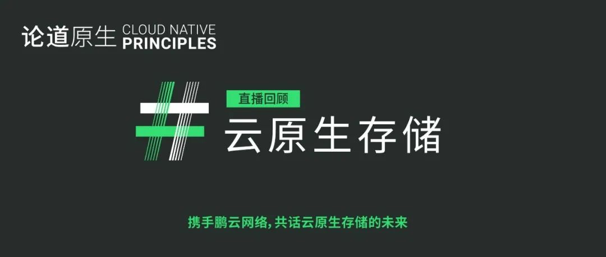
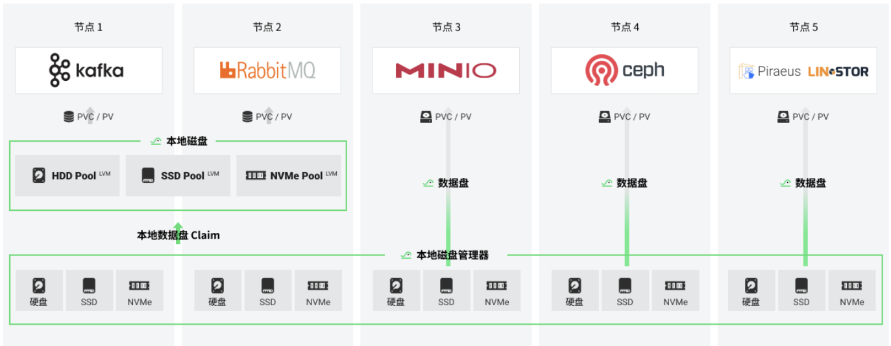
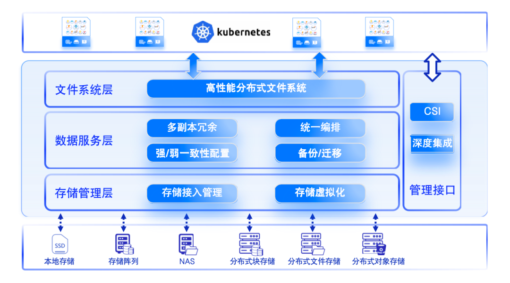

云原生产业的快速发展，为行业应用的实现带来了更多可能性，但也面临更多的挑战。存储是应用运行的基石，随着云原生技术的广泛应用，越来越多的有状态应用被搬上容器平台，有状态应用已成为了存储的主要对象，存储也成为应用容器化过程中的主要难点。在云原生时代下，对存储系统提出了哪些新的要求？云原生存储面临哪些新机遇和新挑战？目前有哪些热门的云原生存储解决方案？

在 6 月 20 日的论道原生直播间，我们携手[鹏云网络](https://www.pengyunnetwork.cn/#/Main)，分享了三个方面内容，云原生本地存储、 Kubernetes (K8s) 场景下云原生存储解决方案，以及 “云原生时代需要什么样的存储系统” 的圆桌讨论，共话云原生存储未来。

## 云原生本地存储 HwameiStor

云原生存储作为云原生堆栈中容器化操作的底层架构之一，将底层存储服务暴露给容器和微服务，可以聚合来自不同介质的存储资源，通过提供持久卷使有状态的工作负载能够在容器内运行。CNCF 官方对于云原生存储形态的定义，一般包括三点，第一是运行在 K8s 上，即其本身是容器形态。第二是使用 K8s 对象类，主要是自定义资源 Custom Resource Define (CRD)。第三是最重要的一点，必须使用容器存储接口 Container Storage Interface (CSI) 。HwameiStor 正是基于以上定义开发的，一个端到端的云原生本地存储系统。

HwameiStor 最底层是一个本地磁盘管理器 Local Disk Manager (LDM)，管理器将各种存储介质 (比如 HDD、SSD 和 NVMe 磁盘) 形成本地存储资源池进行统一管理，管理和接入完全自动。部署完 HwameiStor 后，即可根据介质的不同，分配至不同的资源池。资源池之上采用逻辑卷管理 Logical Volume Manager (LVM) 进行管理，使用 CSI 架构提供分布式的本地数据卷服务，为有状态的云原生应用或组件，提供数据持久化能力。

HwameiStor 是专门为云原生需求设计的存储系统，有高可用、自动化、低成本、快速部署、高性能等优点，可以替代昂贵的传统存储区域网络 Storage Area Network (SAN)。它有三个核心组件：

- 本地盘管理 (LDM)，使用 CRD 定义及管理本地数据盘，通过 LDM，在 K8s内部可明确获取到本地磁盘的属性、大小等信息。

- 本地存储 (LS)，在实现本地盘管理之后，通过 LVM 卷组管理，将逻辑卷 LV 分配给物理卷 PV 。

- 调度器 (Scheduler)，把容器调度到本地有数据的节点上。

HwameiStor 的核心在于自定义资源 CRD 的定义及实现，在 K8s 已有 PersistentVolume (PV) 和 PersistentVolumeClaim (PVC) 对象类之上，Hwameistor 定义了更丰富的对象类把 PV/PVC 和本地数据盘关联起来。

HwameiStor 有四点特性：

- 自动化运维管理，自动发现、识别、管理、分配磁盘，根据亲和性智能调度应用和数据，还可自动监测磁盘状态并及时预警。
- 高可用的数据支持，HwameiStor 使用跨节点副本同步数据，实现高可用，发生问题时，它会自动将应用调度到高可用数据节点上，保证应用的连续性。
- 丰富的数据卷类型，HwameiStor 聚合 HDD、SSD、NVMe 类型的磁盘，提供低延时，高吞吐的数据服务。
- 灵活动态的线性扩展，HwameiStor 根据集群规模大小进行动态的扩容，灵活满足应用的数据持久化需求。

HwameiStor 的应用场景主要包括以下三类：

- 适配高可用架构中间件
  Kafka、ElasticSearch、Redis 等，这类中间件应用自身具备高可用架构，同时对数据的 IO 访问有很高要求。HwameiStor 提供的基于 LVM 的单副本本地数据卷，可以很好地满足它们的要求。

- 为应用提供高可用数据卷
  MySQL 等 OLTP 数据库，要求底层存储提供高可用的数据存储，当发生问题时可快速恢复数据，同时，也要求保证高性能的数据访问。HwameiStor 提供的双副本的高可用数据卷，可以很好地满足此类需求。

- 自动化运维传统存储软件
  MinIO、Ceph 等存储软件，需要使用 K8s 节点上的磁盘，可以采用 PVC/PV 的方式，通过 CSI 驱动自动化地使用 HwameiStor 的单副本本地卷，快速响应业务系统提出的部署、扩容、迁移等需求，实现基于 K8s 的自动化运维。

## K8s 场景下的云原生存储解决方案————ZettaStor HASP

根据云原生基金会 (CNCF) 2020 年度报告，有状态应用已经成为了容器应用的主流，占比达到了 55%，其中有 29% 将存储列为了采用容器技术的主要挑战，而现有云原生环境面临的一个存储难题，就是性能与可用性难以兼顾，单纯使用一种存储，无法满足所有需求。因此在有状态应用的实际落地过程中，数据存储技术是关键。

ZettaStor HASP 是一个云原生高性能数据聚合存储平台，它是一个高性能的用户态文件系统，具备跨异构存储多副本冗余保护的能力。相比传统的分布式存储系统而言，数据副本可以在不同类型的存储系统之间流动。除此之外，还可实现存储资源统一灵活编排，并与容器平台紧密集成。

以三个场景为例：

- 对于 Kafka、Redis、MongoDB、HDFS 等性能要求高，且自身具备数据冗余机制的分布式应用，ZettaStor HASP 拥有更高的数据访问性能，可以实现存储资源动态分配及精细化管理。
- MySQL、PostgreSQL 等自身不提供数据冗余机制，只能依赖外部存储，舍弃本地存储的高性能，ZettaStor HASP 可通过跨节点冗余保护，实现数据的高可用，同时兼具本地存储的高性能。

- 对于关键业务而言，需要防范两节点同时故障的风险，而 ZettaStor HASP 跨本地及外部存储的副本冗余保护，可保障关键业务运行无忧。

ZettaStor HASP 分为三层架构，最上层是高性能的分布式文件系统，也是 HASP 的核心，这个用户态的文件系统是完全自主研发的，全面兼容 POSIX 标准，在用户态与内核态之间实现零数据拷贝，可彻底发挥 NVMe SSD/SCM/PM 等高速介质的性能。第二层是数据服务层，除了在不同节点的本地存储之间、本地存储与外部存储之间、异构外部存储之间提供服务，还可针对单副本和多副本、强一致性和弱一致性分别提供存储方案。第三层是存储管理层，负责对不同的存储设备进行交互，通过统一的数据格式打破设备壁垒及数据孤岛，让数据及业务能够跨异构设备自由流动。除此之外，该系统还可通过 CSI 接口进行存储设备的调度。

ZettaStor HASP 是一个与容器平台紧密结合的分布式存储平台，可进行超融合部署和 CSI 集成，具备节点亲和性，可对用户 Pod 运行状态进行感知，使得存储行为更加适配。

## 圆桌讨论

### Q1: 什么是云原生存储？

[郑泓超](https://github.com/alexzhc)：狭义的云原生存储需要满足三点，第一，与 CSI 接口实现良好的对接，满足 CSI 规范；其次，需要以容器的形式部署在 K8s 上；第三，存储系统内部的信息，也需要通过 CRD 产生新的对象类，并最终存储在 K8s 中。

[冯钦](https://github.com/fengqinah)：云原生上的存储是满足多种特性、多种需求的一个解决方案，除了提供统一的存储平台，应对不同的存储应用，提供不同的存储特性，实现统一纳管之外，还需要对接 CSI 接口，并打通存储与 K8s 之间的交流。

[牛乐川](https://github.com/niulechuan)：现在应用最广的云原生存储，还是在云存储和或者分布式存储的基础上实现云原生化。同时，也有厂商在传统存储具备的特殊能力方面进行一些延伸的尝试。

### Q2: 云原生存储应该如何支持云原生应用？

冯钦：主要分为两个方面，第一，云原生存储需要支持云原生应用的特性，特性决定了应用对于存储的要求。第二，需要满足 CSI 的要求，以支持云原生特殊的需求。

[牛乐川](https://github.com/niulechuan)：从性能角度来看，云原生存储需要全方位满足 CSI 架构的要求，以应对多样化的云原生场景。为了给云原生应用提供良好的底层支持和响应保障，云原生存储需要实现高效运维。根据现实情况，云原生存储在成本、迁移性和技术支持方面也有考量。和云原生应用一样，云原生存储需要 “弹性”，运算方面应当具备弹性扩展能力，数据方面也需要实现扩容缩容，以及冷热数据之间的转换。除此之外，云原生存储应当具备一个开放的生态。

### Q3:云原生存储和传统存储之间的异同点及优劣势？

[郑泓超](https://github.com/alexzhc)：云原生存储部署之后是聚合形态，而传统存储接入 K8s 一般是分离形态。云原生存储因为运行在 K8s 上，有利于开发微服务，而传统存储往往需要开发者进行存储的 API 扩展。但是，聚合形态也在一定程度上，导致 K8s 的问题容易蔓延到存储当中，给运维带来困难。除此之外，云原生存储还存在网络共享和硬盘负载方面的问题。

[冯钦](https://github.com/fengqinah)：外部存储中，存储节点和计算节点之间的影响很低，后端存储一般为分布式存储，安全性和可用性相对较高。但在云原生场景下，单一使用外部存储存在一定的劣势，性能上会增加网络的消耗，同时还存在额外成本增加以及与 K8s 的联动不足的问题。

### Q4: 云原生存储中应该如何赋能传统存储？

[牛乐川](https://github.com/niulechuan)：这是一个非常迫切的需求，对于 K8s 原生的能力，比如删除、创建、扩容的能力，主要是通过 CRD 进行实现，社区也在积极部署。同时，传统存储中积攒的一些能力，尚未在云原生存储体系中得到体现，比如定时任务、可观测性等。如何在平台侧更好地让云原生赋能传统存储，充分发挥双方的优势能力，将云原生存储发展成熟，还有很多需要努力的空间，我们团队也正在进行这方面的研发。

[郑泓超](https://github.com/alexzhc)：再总结一个点，在常规的做法里，K8s 对接传统存储，需要完成的是 CSI 驱动集合，但这只局限于表面，CSI 定义了一部分存储的操作流程，但更多还只是一个接口。所以，CSI 社区是否应该对常规存储的一些功能 (例如定时备份、高可用等) 用 CRD 进行定义？而厂商能否做一部分工作，把一些高级的、特殊的流程用 CRD 进行定义？从而使得 K8s 能在存储领域得到更广泛的应用，是值得我们去思考和实践的。
