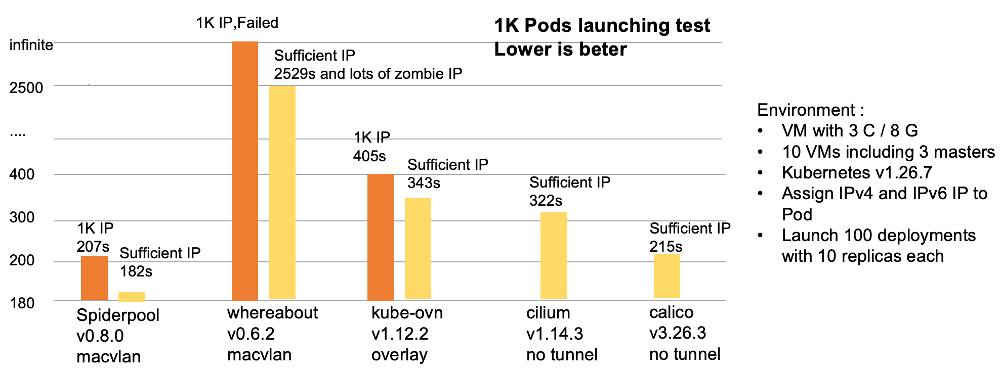

# IPAM 性能测试

**简体中文** | [**English**](./ipam-performance.md)

*[Spiderpool](https://github.com/spidernet-io/spiderpool) 是一个 underlay 网络解决方案，它提供了丰富的 IPAM 和 CNI 整合能力，此文将对比其与市面上主流运行在 underlay 场景下的 IPAM CNI 插件（如 [Whereabouts](https://github.com/k8snetworkplumbingwg/whereabouts)，[Kube-OVN](https://github.com/kubeovn/kube-ovn)）以及被广泛使用的 overlay IPAM CNI 插件 [calico-ipam](https://github.com/projectcalico/calico)、[cilium](https://github.com/cilium/cilium) 在 `1000 Pod` 场景下的性能表现。*

## 背景

为什么要做 underlay IPAM CNI 插件的性能测试？

1. IPAM 分配 IP 地址的速度，很大程度上的决定了应用发布的速度。
2. 大规模的 Kubernetes 集群在故障恢复时，underlay IPAM 往往会成为性能瓶颈。
3. underlay 网络下，私有的 IPv4 地址有限。在有限的 IP 地址范围内，并发的创建 Pod 会涉及 IP 地址的抢占与冲突，能否快速的调节好有限的 IP 地址资源具有挑战。

## 环境

- Kubernetes: `v1.26.7`
- container runtime: `containerd v1.7.2`
- OS: `Ubuntu 22.04 LTS`
- kernel: `5.15.0-33-generic`

| Node     | Role                  | CPU | Memory |
| -------- | --------------------- | --- | ------ |
| master1  | control-plane, worker | 3C  | 8Gi    |
| master2  | control-plane, worker | 3C  | 8Gi    |
| master3  | control-plane, worker | 3C  | 8Gi    |
| worker4  | worker                | 3C  | 8Gi    |
| worker5  | worker                | 3C  | 8Gi    |
| worker6  | worker                | 3C  | 8Gi    |
| worker7  | worker                | 3C  | 8Gi    |
| worker8  | worker                | 3C  | 8Gi    |
| worker9  | worker                | 3C  | 8Gi    |
| worker10 | worker                | 3C  | 8Gi    |

## 测试对象

本次测试基于 `0.3.1` 版本的 [CNI Specification](https://www.cni.dev/docs/spec/)，以 [macvlan](https://www.cni.dev/plugins/current/main/macvlan/) 搭配 Spiderpool 作为测试方案，并选择了开源社区中其它几种常见的网络方案作为对比：

| 测试对象                       |      版本     |
| ----------------------------- | ------------ |
| Spiderpool based on macvlan   | `v0.8.0`     |
| Whereabouts based on macvlan  | `v0.6.2`     |
| Kube-OVN                      | `v1.12.2`    |
| Cilium                        | `v1.14.3`    |
| Calico                        | `v3.26.3`    |

## 方案

测试思路主要是：

1. Underlay IP 资源有限，IP 的泄露和分配重复，容易造成干扰 ，因此 IP 分配的准确性非常重要。
2. 在大量 Pod 启动时竞争分配 IP，IPAM 的分配算法要高效，才能保障 Pod 快速发布成功。

因此，设计了 IP 资源和 Pod 资源数量相同的极限测试，计时 Pod 从创建到 Running 的时间，来变相测试 IPAM 的精确性和健壮性。测试的条件如下：

- IPv4 单栈和 IPv4/IPv6 双栈场景。
- 创建 100 个 Deployment，每个 Deployment 的副本数为 10。

## 测试结果

如下展示了 IPAM 性能测试结果，其中，包含了 `限制 IP 与 Pod 等量` 和 `不限制 IP 数量` 两种场景，来分别测试每个 CNI ，而 Calico 和 Cilium 等是基于 IP block 预分配机制分配 IP，因此没法相对 "公平" 的进行 `限制 IP 与 Pod 等量` 测试，只进行 `不限制 IP 数量` 场景测试。

  |       测试对象                |   限制 IP 与 Pod 等量    |   不限制 IP 数量  |
  | ---------------------------  | ---------------------- | --------------- |
  | Spiderpool based on macvlan  |          207s          |       182       |
  | Whereabouts based on macvlan |          失败           |       2529s    |
  | Kube-OVN                     |          405s          |       343s      |
  | Cilium                       |           NA           |       215s      |
  | Calico                       |           NA           |       322s      |

## 分析



Spiderpool 的 IPAM 分配原理，是整个集群节点的所有 Pod 都从同一个 CIDR 中分配 IP，所以 IP 分配和释放需要面临激烈的竞争，IP 分配性能的挑战会更大；Whereabouts 和 Calico 、Cilium的 IPAM 分配原理，是每个节点都有一个小的 IP 集合，所以 IP 分配的竞争比较小，IP 分配性能的挑战会小。但从上述实验数据上看，虽然 Spdierpool 的 IPAM 原理是 "吃亏" 的，但是分配 IP 的性能却是很好的。

- 在测试过程中，遇到如下现象：

  Whereabouts based on macvlan：在`限制 IP 与 Pod 等量`场景下，在 300s 内 261 个 Pod 以较为匀速的状态达到了 `Running` 状态，在 1080s 时，分配 768 个 IP 地址。自此之后的 Pod 增长速率大幅降低，在 2280s 时达到 845 个，后续 Whereabouts 就基本不工作了，耗时类比于正无穷。由于 IP 地址数量与 Pod 数等量，如果 IPAM 组件未能正确的回收 IP，新 Pod 将因为缺少 IP 资源，且无法获取到可用的 IP，从而无法启动。并且观察到在启动失败的 Pod 中，出现了如下的一些错误：

  ```bash
  [default/whereabout-9-5c658db57b-xtjx7:k8s-pod-network]: error adding container to network "k8s-pod-network": error at storage engine: time limit exceeded while waiting to become leader

  name "whereabout-9-5c658db57b-tdlms_default_e1525b95-f433-4dbe-81d9-6c85fd02fa70_1" is reserved for "38e7139658f37e40fa7479c461f84ec2777e29c9c685f6add6235fd0dba6e175"
  ```

## 总结

虽然 Spiderpool 是一种适用于 Underlay 网络的解决方案，但其提供了强大的 IPAM 能力，其 IP 分配以及回收的特点相较于主流 Overlay CNI 的 IPAM 插件，面临着更多的、复杂的 IP 地址抢占与冲突的问题，但它的性能表现领先于后者。
