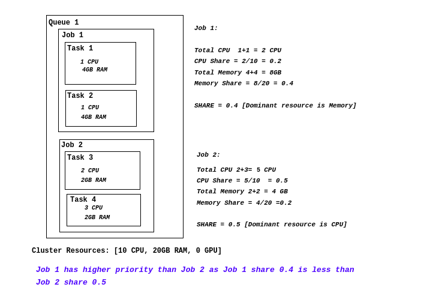
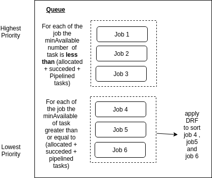

## Dominant Resource Fairness (DRF)

## Introduction
Dominant Resource Fairness (DRF), a generalization of max-min fairness to multiple resource types is a resource allocation policy that handles multiple resource types.

Dominant resource - a resource of specific type (cpu, memory, gpu) which is most demanded by given job among other resources it needs. This resource is identified as a share of the total cluster resources of the same type.

DRF computes the share of dominant resource allocated to a job (dominant share) and tries to maximize the smallest dominant share in the system.
Schedule the task of the job with smallest dominant resource

## Kube-Batch Implementation
DRF calculate shares for each job. The share is the highest value of  ratio of the (allocated resource/Total Resource) of the three resource types CPU, Memory and GPU.
This share value is used for job ordering and task premption.

#### 1. Job Ordering:
  The job having the lowest share will have higher priority.
  In the example below all the tasks task1, task2 of job1 and task3 and task4 of job2 is already allocated to the cluster.
  

 ##### 1.1 Gang Scheduling with DRF in job ordering ( Gang -> DRF)
   Gang scheduling sorts the job based on whether the job has at least **minAvailable** task already (allocated + successfully completed + pipelined) or not.
   Jobs which has not met the minAvailable criteria has higher priority than jobs which has met
   the minAvailable criteria.

   For the jobs which has met the minAvailable criteria will be sorted according to DRF.

   

#### 2. Task Preemption:

The preemptor can only preempt other tasks only if the share of the preemptor is less than the share of the preemptee after recalculating the resource allocation  of the premptor and preemptee.
